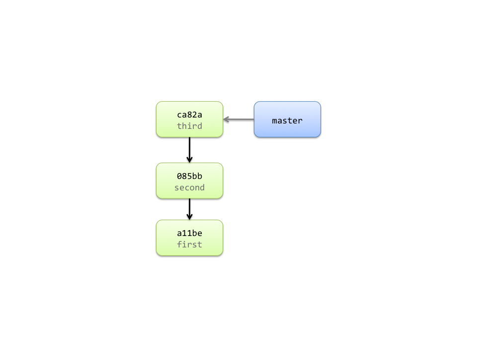

!SLIDE commandline incremental

	$ svn checkout URL local-dir
	A    local-dir/README
	A    local-dir/Rakefile
	A    local-dir/lib
	A    local-dir/lib/simplegit.rb
	Checked out revision 3.

	$ git clone URL local-dir
	Cloning into local-dir...
	remote: Counting objects: 13, done.
	remote: Compressing objects: 100% (8/8), done.
	remote: Total 13 (delta 3), reused 13 (delta 3)
	Receiving objects: 100% (13/13), done.
	Resolving deltas: 100% (3/3), done.

!SLIDE center

