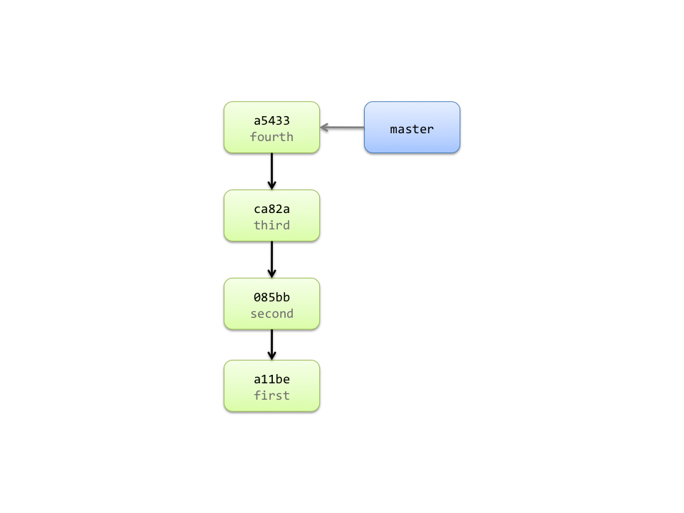

!SLIDE commandline incremental

	$ svn commit -m "fourth"
	Adding         TODO
	Transmitting file data .
	Committed revision 4.

	$ git commit -m "fourth"
	[master a543355] fourth
	 1 files changed, 1 insertions(+), 0 deletions(-)
	 create mode 100644 TODO

!SLIDE center

