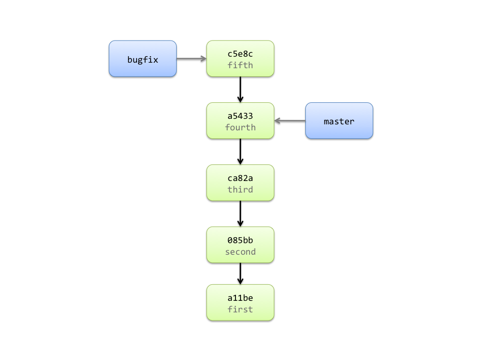

!SLIDE commandline incremental

	$ svn copy URL/trunk URL/branches/bugfix
	Committed revision 5.
	$ svn switch URL/branches/bugfix .
	$ <add a new file and commit>

	$ git checkout -b bugfix
	Switched to a new branch 'bugfix'
	$ <add a new file and commit>
	[bugfix c5e8c24] fifth
	 1 files changed, 1 insertions(+), 0 deletions(-)
	 create mode 100644 TEST

!SLIDE center

