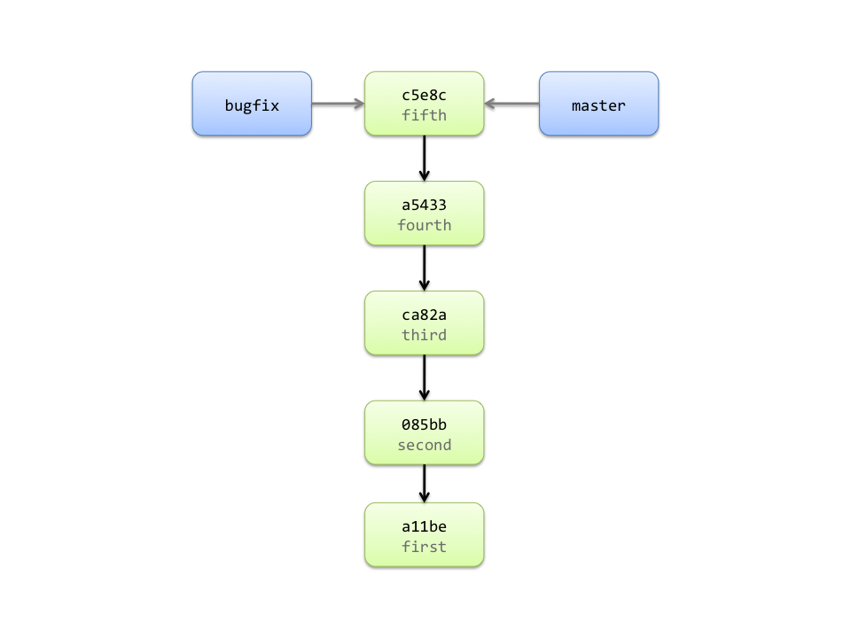

!SLIDE commandline incremental

	$ svn merge -r 4:HEAD URL/branches/bugfix
	$ <commit merged changes into trunk>

	$ git checkout master 
	Switched to branch 'master'
	Your branch is ahead of 'origin/master' by 1 commit.
	$ git merge bugfix
	Updating a543355..c5e8c24
	Fast-forward
	 TEST |    1 +
	 1 files changed, 1 insertions(+), 0 deletions(-)
	 create mode 100644 TEST

!SLIDE center

