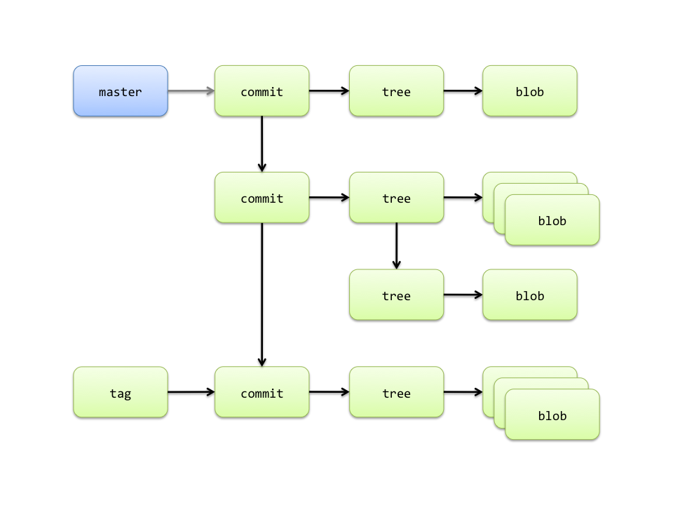

!SLIDE
## Internals ##

!SLIDE center

!SLIDE code smaller

	$ git ls-tree 999902bd8ee2b07e19c96f11bddf475527fff3d4
	100644 blob 159202af1c0374e33374f2a0e20b5e0ecbc0c19e .gitignore
	100644 blob 37e1207dab85993425ee5f4ceb2a59055dccfc77 .gitmodules
	100644 blob e04728e8d391f57a6fa0c3325118750c602ef5ef Capfile
	100644 blob 2af0fb1133d03dcedf1f2bbca9a9b04444ef84f0 README
	100644 blob 3bb0e8592a41ae3185ee32266c860714980dbed7 Rakefile
	100644 blob 70d0345e4619e790993e852fe0ed1946d8d53afc TODO.txt
	040000 tree 875c4668c815306dcb1de23407973e2f1fb9d3a8 app
	040000 tree 942fb533688aa713f5302b525cf0b8cfeb245d8b config
	040000 tree da543b1ab388687f5612e6fb7c06fc778b8026bc db
	040000 tree 0269300738b048a5cc34769d1436d9f228499018 doc
	040000 tree 5a86b1e544e01c8951edafc39a3b0ca7bf09c2e9 lib
	040000 tree 0289883d028de7e3c8c54a7fa09c2851fda8346f public
	040000 tree 5ecf890b2a8c6d1e6b76b7d2ac25a4e40cf2cc67 script
	040000 tree c900b82e1d3f53af6392341f4ecf2a271961c26a spec
	040000 tree 3d5fc32106bf1848bcb79ef8a9f0fbf06e858fed vendor

!SLIDE code smaller

	$ git cat-file -p e04728e8d391f57a6fa0c3325118750c602ef5ef
	load ‘deploy’ if respond_to?(:namespace)
	Dir['vendor/plugins/*/recipes/*.rb'].each {
		|plugin| load(plugin)
		}
	
	load ‘config/deploy’

!SLIDE code smaller

	$ git cat-file -p 875c4668c815306dcb1de23407973e2f1fb9d3a8
	040000 tree 3e6fae3a140890d75eb9d51ce0974f7969194661 controllers
	040000 tree 77b99dd8afcf55ad613d51e9e18a3df1aafa3f62 helpers
	040000 tree 41c9c92d8f11afe27f2f25fa6bad867d6427cfbe models
	040000 tree c958c76cd2ccda49b3d514a1a12b2236974300c2 sweepers
	040000 tree 850a76c0d5d056c43d56bc5d987836ea296584f4 views
	040000 tree 4c713208aee9f3bfb172424e3a68f2a1f10d715a workers

!SLIDE code smaller

	$ git cat-file -p master:
	tree dcad9007245d68ff56d90fcf96af38f686eb61c1
	parent 4d9cb9b0d6248bb5c0868261039ef7f56ce47494
	author Jan Varwig <jan@varwig.org> 1300882710 +0100
	committer Jan Varwig <jan@varwig.org> 1300882710 +0100
	
	Wrote Helper methods in User to aid with taking down accounts

!SLIDE code smaller

	$ git cat-file -p test_tag
	object 4a06c46ee6d58ce4be09954ee054921b18269cd6
	type commit
	tag test_tag
	tagger Jan Varwig <jan@varwig.org> Fri Apr 15 19:42:02 2011
	
	This is the message for the test tag
